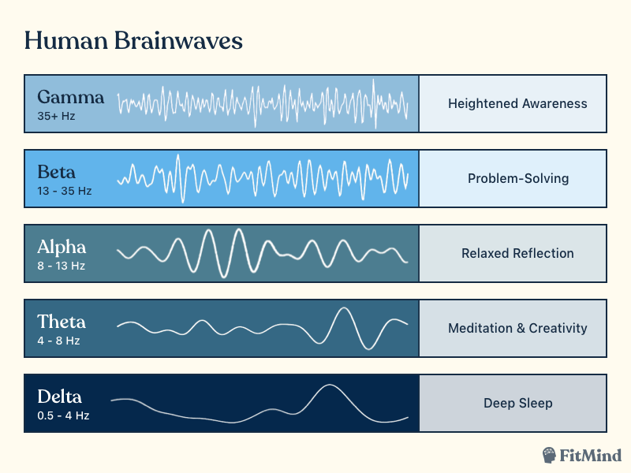

<h2>Theory</h2>

Biomedical signals are the physiological signals generated within
the human body that carry useful information about different
organs and their functioning. These signals are produced by
electrical, mechanical, chemical, or thermal activities occurring
in cells and tissues. Studying and analyzing such signals is
essential for medical diagnosis, monitoring, and treatment.  

Among these, bioelectric signals are the most significant, as they originate from the natural electrical activity of excitable tissues such as the heart, brain, muscles, and nerves. These signals are detected using electrodes and recorded in graphical form for clinical use. 

<h4>Bioelectric Potential</h4>
Bioelectric potentials are the voltage differences generated by ionic currents across cell membranes during depolarization repolarization. These potentials can be measured either directly inside a cell using needle electrodes or, more commonly, at the surface of the body using electrodes. 

Depending on the source organ or tissue, bioelectric potentials are classified into different types such as:

<h4>1. Electrocardiogram (ECG)</h4>

 

The electrocardiogram (ECG) is the recording of the heart's electrical activity, obtained by measuring the biopotentials
generated during depolarization and repolarization of the
cardiac muscles. Measured using surface electrodes placed at
specific points on the body. 

The interior of the cell membrane is considered to be negative
with respect to the outside during resting conditions. When an
electric impulse is generated in the heart, the interior part
becomes positive with respect to the exterior. This change of
polarity is called depolarization. After depolarization the cell
comes back to its original state. This phenomenon is called
repolarization. The ECG records the electrical signal of the
heart as the muscle depolarizes (contract) and repolarizes. 

<b>Signal Characteristics:</b> 

- Amplitude: Approximately 0.1 – 4 mV  
- Frequency content: From DC up to ~100 Hz 

<b>Clinical significance:</b> 

- Used to assess heart rate and rhythm  
- Helps detect cardiac abnormalities such as arrhythmias and  
- Provides a valuable timing reference in cardiovascular measurements 

<b>ECG Waveform:</b> 
The diagram below shows the principal components of a standard ECG signal:

 

<b>Figure 1: The Electrocardiogram Waveform.</b>
 

**Key Components:**

- **P wave:** Atrial depolarization
- **QRS complex:** Ventricular depolarization
- **T wave:** Ventricular repolarization

Various intervals, such as the PR interval and QT interval,
correspond to different phases of the cardiac cycle. Each
feature can be analyzed to assess heart function and detect
abnormalities.  
<!-- 
  -->
<h4 style="margin-left: -2%">2. Electroencephalogram (EEG)</h4>

The electroencephalogram (EEG) is the recording of the brain's electrical activity, obtained by measuring the biopotentials generated by neuronal activity at the surface of the scalp or directly within brain tissue. Recorded using surface electrodes placed on the scalp, or in some cases using needle electrodes inserted into brain tissue. 

<b>Origin:</b> 
- Generated by the electrical activity of neurons in the brain, resulting mainly from postsynaptic potentials of large groups of cortical cells. 

<b>Signal Characteristics:</b> 
- Amplitude: Approximately 10 – 100 μV (peak) 
- Frequency content: From DC up to ~100 Hz 

<b>Clinical Significance:</b> 
- Used to study characteristic brain waveforms (e.g., alpha, beta, delta, theta rhythms) 
- Helps in detection and diagnosis of neurological disorders, such as epilepsy 
- Useful for spectral analysis of brain activity and for measuring evoked potentials in response to stimuli 
- Plays a key role in monitoring brain states like sleep, consciousness, and anesthesia 

<b>Typical EEG Waveforms and Frequency Bands:</b> 
EEG signals differ based on electrode placement and brain activity. To interpret them, they are commonly divided into distinct frequency bands, each named after a Greek letter, and each associated with specific mental states. 

 

<b>Figure 2: Human BrainWaves (EEG)</b>
 

**Frequency Bands:**  
- **Delta (below 3 Hz):** Prominent in deep sleep 
- **Theta (3–8 Hz):** Associated with light sleep and drowsiness 
- **Alpha (8–13 Hz):** Seen when relaxed with eyes closed, representing synchronized brain activity 
- **Beta (13–30 Hz):** Linked to alertness and active thinking, showing desynchronized patterns 
- **Gamma (30–100 Hz):** Related to higher cognitive functions such as perception, memory processing, and consciousness  

<h4 style="margin-left: -2%">3. Electromyogram (EMG)</h4>

The electromyogram (EMG) is the recording of the electrical activity produced by skeletal muscles during contraction and relaxation. These signals arise from the depolarization and repolarization of muscle fibers, reflecting the summed action potentials of motor units. 

<b>Methods of Measurement:</b> 
- Surface Electrodes: Placed on the skin above the muscle group; capture activity from multiple fibers 
- Needle Electrodes: Inserted directly into the muscle tissue for localized recording, useful when nearby large muscles interfere 

<b>Signal Characteristics:</b> 
- Amplitude: Approximately 50 μV to 1 mV 
- Frequency content: From about 10 Hz up to 3 kHz 

<b>Clinical Significance:</b> 
- Indicates muscle contraction intensity and timing 
- Used to study muscle fatigue and neuromuscular function 
- Aids in diagnosing neuromuscular disorders such as myasthenia gravis, neuropathies, or muscular dystrophy 
- Important in rehabilitation monitoring and prosthetic control applications 

<b>Typical EMG Waveform:</b> 
The EMG signal is a complex, noise-like pattern representing the instantaneous sum of action potentials from multiple muscle fibers. When the muscle is at rest (baseline), the signal is minimal. During muscle contraction, the waveform amplitude increases, producing an interference pattern that obliterates the baseline. The energy and shape of the EMG waveform depend on the level of muscle activity and electrode placement. 

 

<b>Figure 3: Typical ElectroMyoGram (EMG) waveform.</b>
 

  
<h4>Other Bioelectric Potentials</h4>

In addition to the three primary bioelectric signals—ECG, EEG, and EMG—there are other important bioelectric potentials used in clinical settings. 

<h4>4. Electrogastrogram (EGG)</h4>

The electrogastrogram (EGG) is the recording of the bioelectric potentials generated by the smooth muscles of the stomach and intestines. These slow-wave potentials represent the rhythmic electrical activity that controls gastric motility and peristaltic movements in the gastrointestinal tract. The EGG is typically recorded non-invasively using surface electrodes placed on the abdominal wall. It helps in assessing gastric rhythm disorders such as gastroparesis and abnormal motility patterns. 

<h4>5. Electroretinogram (ERG)</h4>

The electroretinogram (ERG) is the recording of the electrical response of the retina to a flash of light or visual stimulus. It reflects the summed activity of various retinal cells, including photoreceptors, bipolar, and ganglion cells. The ERG waveform typically includes an a-wave (negative deflection from photoreceptor activity) and a b-wave (positive deflection from bipolar and Müller cells). Clinically, the ERG is used to diagnose retinal disorders such as retinitis pigmentosa, cone-rod dystrophy, and other degenerative eye diseases. 

<h4>6. Electrooculogram (EOG)</h4>

The electrooculogram (EOG) measures the potential difference between the cornea and the retina, which changes with eye movement. This corneo-retinal potential acts as a dipole, and electrodes placed around the eyes detect voltage changes as the eyes move horizontally or vertically. The EOG is used to record eye position and movement, assess retinal function, and in some applications, control assistive devices or interfaces. It is also used clinically to evaluate retinal pigment epithelium (RPE) function. 
